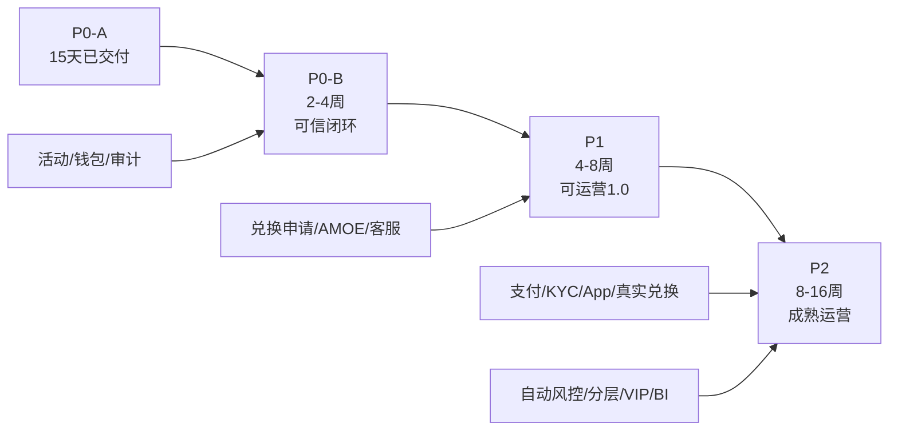
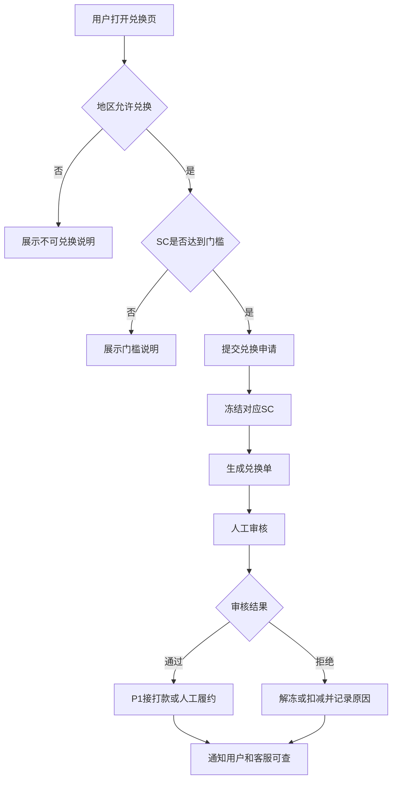
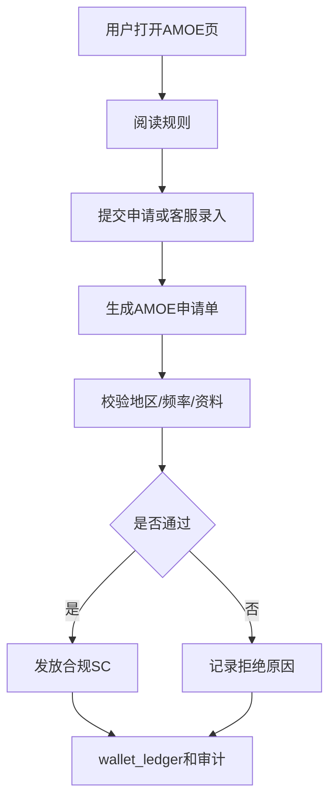
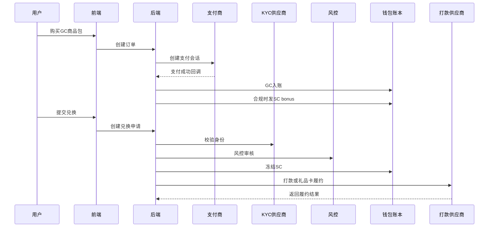

# Tang Luck 15 天后迭代路线与可运营 1.0 方案

## 1. 文档信息

| 项目 | 内容 |
| --- | --- |
| 文档名称 | Tang Luck 15 天后迭代路线与可运营 1.0 方案 |
| 承接阶段 | P0-A 15 天交付完成后 |
| 覆盖范围 | P0-B、P1、P2 |
| 适用角色 | 客户、产品、运营、研发、QA、客服、风控、法务、支付商务、App 上架负责人 |
| 关联文档 | `TangLuck可运营可评审可验收最终PRD.md`、`TangLuck15天冲刺执行表.md` |
| 重要边界 | 本文是 15 天之后的连续迭代方案；真实支付、KYC、兑换、App 上架、SC 发放仍以律师、支付商、平台审核确认结果为准 |

## 2. 核心结论

15 天 P0-A 完成后，不能立刻做“大而全运营”，而应该按以下顺序推进：

1. **P0-B：补可信闭环**  
   先把兑换申请、SC 冻结、客服工单、AMOE 申请、活动审计补齐，解决用户拿到 SC 后“能不能查、能不能问、能不能申请”的问题。

2. **P1：接商业化和真实运营**  
   在律师、支付商、KYC/打款供应商确认后，再接 GC 商品包、支付、KYC、真实兑换、邀请、排行榜、转盘、会员基础和 App 上架材料。

3. **P2：做放量能力**  
   等支付、兑换、客服、风控稳定后，再做自动风控、A/B、用户分层、VIP、支付冗余和运营日历。

## 3. 15 天后总路线图



## 4. P0-B：15 天后 2-4 周可信闭环

### 4.1 阶段目标

P0-B 的目标不是增加活动数量，而是补齐用户信任闭环：

| 目标 | 说明 |
| --- | --- |
| 用户知道 SC 来源 | 钱包流水、SC 来源说明、活动规则可查 |
| 用户可以提交兑换申请 | 不做自动打款，但能提交、冻结、审核 |
| 用户可以提交 AMOE | 免费参与路径从静态说明升级为申请流程 |
| 客服可以处理问题 | 奖励未到账、兑换问题、AMOE 咨询可建工单 |
| 运营可以追溯规则 | 活动规则快照、配置变更日志、发奖审计完整 |

### 4.2 P0-B 功能清单

| 模块 | 功能 | 说明 | 优先级 |
| --- | --- | --- | --- |
| 兑换申请 | 兑换入口、规则页、申请单、SC 冻结 | 不做真实打款 | P0-B1 |
| 兑换审核后台 | 查看用户、SC 来源、风险、审核动作 | 人工审核 | P0-B1 |
| 客服工单 | 奖励、兑换、AMOE、账号、地区限制 | 关联业务单 | P0-B1 |
| AMOE 申请 | 用户申请、客服录入、审核、发 SC | 法务确认后开放 | P0-B1 |
| 活动审计 | 活动规则快照、发布记录、修改记录 | 支撑争议处理 | P0-B1 |
| 游戏入口 | 游戏列表、试玩入口、基础局记录 | 可接少量游戏 | P0-B2 |
| 风控增强 | 风险用户标记、人工审核队列 | 先人工为主 | P0-B2 |
| BI 漏斗 | 注册、领奖、首局、兑换点击、客服 | 用于复盘 | P0-B2 |

### 4.3 P0-B 兑换流程



### 4.4 P0-B AMOE 流程



### 4.5 P0-B 数据与接口

| 表/接口 | 用途 | 说明 |
| --- | --- | --- |
| `redemption_requests` | 兑换申请 | 状态、SC 数量、冻结流水、审核人 |
| `amoe_requests` | AMOE 申请 | 申请方式、频率、结果、发奖 |
| `support_tickets` | 客服工单 | 工单分类、关联业务单、SLA |
| `game_sessions` | 游戏局记录 | P0-B 可简化 |
| `/redemptions` | 提交兑换 | P0-B 开放申请 |
| `/amoe/requests` | 提交 AMOE | 法务确认后开放 |
| `/support/tickets` | 创建工单 | P0-B 必做 |
| `/admin/redemptions` | 兑换审核 | 后台 |
| `/admin/amoe` | AMOE 审核 | 后台 |

### 4.6 P0-B 验收标准

```gherkin
Feature: P0-B 可信闭环
  Scenario: 用户提交兑换申请
    Given 用户在允许地区
    And 用户 SC 达到最低门槛
    When 用户提交兑换申请
    Then 系统冻结对应 SC
    And 生成 redemption_request
    And 后台可审核

  Scenario: 用户提交 AMOE 申请
    Given AMOE 已由法务确认开放
    When 用户提交 AMOE 申请
    Then 系统生成 amoe_request
    And 后台可审核
    And 通过后写入 wallet_ledger
```

## 5. P1：4-8 周可运营 1.0

### 5.1 阶段目标

P1 的目标是进入小规模真实运营，但必须以外部确认作为前置条件。

| 前置条件 | 未满足时处理 |
| --- | --- |
| 美国律师确认州级策略 | 不开放真实 SC/AMOE/兑换 |
| 支付商准入确认 | 不开放真实 GC 购买 |
| KYC/打款供应商确认 | 不开放真实兑换 |
| App 审核策略确认 | 不正式提审 iOS/Android |

### 5.2 P1 功能清单

| 模块 | 功能 | 合规/运营注意事项 |
| --- | --- | --- |
| GC 商品包 | 商品包、价格、订单、支付回调 | 只卖 GC，不卖 SC |
| 支付 | 支付成功、失败、退款、拒付、对账 | 未准入不开放 |
| KYC | 身份验证、地址验证、失败原因、申诉 | 兑换前置 |
| 真实兑换 | 审核、打款、失败重试、通知 | 不承诺保证到账 |
| 邀请奖励 | 注册、首局、KYC 分段奖励 | 默认只发 GC |
| 排行榜 | 日榜、周榜、任务积分榜 | 默认只发 GC，榜单冻结后审核 |
| 转盘 | 免费次数、奖池、概率、库存 | SC 必须法务确认 |
| 会员基础 | 等级、经验、权益包 | 不绕过 KYC/风控 |
| App 上架材料 | 审核账号、规则页、支付说明 | 审核结果不可承诺 |
| BI 漏斗 | 注册、领奖、首局、购买、KYC、兑换 | 小流量复盘 |

### 5.3 P1 购买到兑换链路



### 5.4 P1 活动策略

| 活动 | 默认奖励 | SC 策略 | 上线条件 |
| --- | --- | --- | --- |
| 邀请奖励 | GC、经验、Coupon | 默认 `gc_only` | 风控关系链完成 |
| 排行榜 | GC、徽章、经验 | 默认 `gc_only` | 榜单冻结和审核完成 |
| 转盘 | GC、Coupon | `legal_required` | 法务确认概率/奖池 |
| 会员 | GC、权益 | 默认 `gc_only` | 会员规则和客服 SOP 完成 |
| 支付 Coupon | Coupon/GC | 不发 SC | 支付商准入后 |

### 5.5 P1 验收标准

| 模块 | 验收标准 |
| --- | --- |
| 支付 | 成功、失败、重复回调、退款、拒付均可处理 |
| KYC | 通过、失败、补资料、申诉流程可跑通 |
| 兑换 | 状态机完整，冻结、审核、打款、失败可追踪 |
| App | 审核账号、规则页、地区限制、支付说明准备完成 |
| 活动 | 邀请、榜单、转盘、会员均受 SC 策略和风控控制 |
| BI | 可查看注册到购买、KYC、兑换、投诉漏斗 |

## 6. P2：8-16 周成熟运营

### 6.1 阶段目标

P2 的目标是放量前的运营自动化和风险控制，不是单纯增加活动。

| 目标 | 说明 |
| --- | --- |
| 自动风控 | 按风险等级决定发 GC、发 SC、延迟、拒绝、人工审核 |
| 用户分层 | 新手、活跃、付费、待兑换、流失、高风险 |
| A/B 测试 | 活动入口、奖励强度、任务组合、文案 |
| VIP 增强 | 权益包、客服优先、生日礼包、保级 |
| 支付冗余 | 多通道、失败降级、拒付预警 |
| 运营日历 | 周、月、节日、召回、会员日 |

### 6.2 P2 功能清单

| 模块 | 功能 |
| --- | --- |
| 自动风控 | 风险评分、自动拦截、延迟发奖、自动放行 |
| A/B 测试 | 活动、任务、商店、文案实验 |
| 用户分层 | 标签、分群、分层活动 |
| VIP 增强 | 等级权益、保级、专属客服 |
| BI/LTV | 渠道质量、LTV、兑换率、拒付率、投诉率 |
| 支付冗余 | 第二支付通道、失败重试、对账预警 |
| 运营日历 | 可视化排期、预算、负责人、复盘 |

### 6.3 P2 用户分层策略

| 用户层 | 推荐运营 | 默认奖励 | SC 策略 |
| --- | --- | --- | --- |
| D0 新用户 | 注册赠送、新手任务 | GC + 小额 SC | 可小额，受控 |
| D1-D7 新手 | 每日登录、连续任务 | GC、少量 SC | 低额受控 |
| D8-D30 成长 | 周任务、Coupon、免费转盘 | GC、Coupon | 默认只发 GC |
| 付费用户 | GC 商品包、会员权益 | GC、Coupon、权益 | 不因购买直接发 SC |
| 待兑换用户 | 规则提醒、KYC 引导、客服 | 状态提醒 | 不发奖励 |
| 流失用户 | 召回 Coupon、GC 礼包 | GC、Coupon | 默认只发 GC |
| 高风险用户 | 限制活动、人工审核 | 无或 GC | 不发 SC |

### 6.4 P2 验收标准

| 模块 | 验收标准 |
| --- | --- |
| 自动风控 | 风险等级能影响活动、购买、兑换 |
| A/B 测试 | 实验组、对照组、指标、回滚完整 |
| 用户分层 | 可按标签配置活动和看板 |
| VIP | 权益不绕过 KYC/风控/兑换审核 |
| 支付冗余 | 主通道失败可切换或提示 |
| BI | 可按渠道和 cohort 查看 LTV、兑换、拒付、投诉 |

## 7. 15 天后组织分工

| 角色 | P0-B | P1 | P2 |
| --- | --- | --- | --- |
| 产品 | 兑换/AMOE/客服规则 | 支付/KYC/App/活动增强 | 分层/VIP/A-B |
| 后端 | 兑换、AMOE、工单、审计 | 支付、KYC、打款、榜单 | 自动风控、实验、BI |
| 前端 | 兑换页、AMOE、客服页 | 商店、KYC、会员、排行榜 | 分层活动、VIP |
| QA | 可信闭环测试 | 支付/KYC/兑换/App 测试 | 自动化和回归 |
| 运营 | 客服 SOP、活动复盘 | 小流量运营、活动日历 | 放量运营 |
| 法务 | AMOE、兑换、规则确认 | 商品包、App、支付确认 | 活动模板复审 |
| 支付商务 | 支付商预沟通 | 准入申请和联调 | 通道冗余 |

## 8. 15 天后上线阻断条件

| 能力 | 阻断条件 |
| --- | --- |
| 真实 SC 发放扩大 | 未取得律师确认 |
| AMOE 申请 | AMOE 规则未确认 |
| 真实购买 | 支付商未准入 |
| SC bonus | 律师和支付商未确认 |
| 真实兑换 | KYC/打款供应商未确认 |
| App 提审 | 审核材料和策略未确认 |
| 自动发奖 | 风控和审计未完成 |
| 放量运营 | 支付、兑换、客服、风控未稳定 |

## 9. 15 天后交付物

| 阶段 | 交付物 |
| --- | --- |
| P0-B | 兑换申请 PRD、AMOE 申请 PRD、客服 SOP、活动审计说明、P0-B 测试报告 |
| P1 | 支付 PRD、KYC/兑换 PRD、App 上架包、支付商准入回执、可运营 1.0 验收报告 |
| P2 | 自动风控 PRD、用户分层 PRD、VIP PRD、BI/LTV 看板、放量运营检查表 |

## 10. 最终建议

1. 15 天后第一优先级不是支付，而是 P0-B 的兑换申请、AMOE、客服、审计。
2. P1 接真实购买和兑换前，必须先完成律师、支付商、KYC/打款供应商确认。
3. 活动增强要跟着风控走，不要先上邀请、排行榜、转盘再补风控。
4. App 上架要提前准备材料，但不要把 App 上架作为唯一入口，Web/PWA 必须保留兜底。
5. P2 的核心是放量稳定性：自动风控、BI、客服、支付冗余，而不是单纯增加活动数量。
