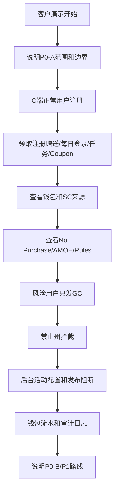

# Tang Luck 15 天客户演示脚本

## 1. 演示目标

本文用于 P0-A 15 天交付后的客户演示。目标不是展示完整商业化平台，而是证明 Tang Luck 已经具备美国 Sweepstakes Casino 合规活动运营的最小闭环。

演示应控制在 20-30 分钟内，重点展示：

1. 用户可注册并确认条款。
2. GC/SC 双钱包可创建、展示、入账、追溯。
3. 注册赠送、每日登录、每日任务、Coupon 可配置、可领取。
4. 风险用户可被降级为只发 GC 或拦截。
5. No Purchase Necessary、AMOE、Rules 入口可访问。
6. 后台可配置活动、查看流水、审计日志和基础看板。

## 2. 演示账号

| 账号 | 地区 | 风险 | 用途 |
| --- | --- | --- | --- |
| `demo.normal@tangluck.com` | CA | low | 正常注册、领奖、任务、钱包 |
| `demo.risk@tangluck.com` | CA | manual_review | 展示风险用户只发 GC |
| `demo.blocked@tangluck.com` | WA | blocked | 展示禁止州/限制州拦截 |
| `admin.ops@tangluck.com` | - | ops_admin | 后台活动配置和看板 |
| `admin.risk@tangluck.com` | - | risk_admin | 风控事件和审计 |

## 3. 演示前准备

| 准备项 | 标准 |
| --- | --- |
| 活动配置 | 注册赠送、每日登录、查看 Rules 任务、Coupon 已 active |
| 规则文档 | Terms、Sweepstakes Rules、Privacy、No Purchase Necessary、AMOE 链接可打开 |
| 地区配置 | CA 允许注册/SC；WA 禁止或限制 |
| 钱包数据 | 正常用户初始 GC/SC 为 0，可通过演示领取 |
| Coupon | 准备 `WELCOME500`，奖励 500 GC |
| 后台账号 | 运营、风控账号可登录 |
| 审计日志 | 后台发布、暂停、发奖可生成审计 |

## 4. 演示流程

### 4.1 开场说明

| 话术 | 重点 |
| --- | --- |
| “本次演示是 P0-A 15 天版本，重点是合规活动运营最小闭环。” | 避免客户误以为已包含真实支付和真实兑换 |
| “平台采用 GC/SC 双币，GC 可购买，SC 不销售。” | 合规边界 |
| “No Purchase Necessary 和 AMOE 是独立入口。” | 免费参与路径 |
| “真实支付、KYC、兑换、App 上架在 P1 前需要外部确认。” | 风险边界 |

### 4.2 C 端正常用户链路

| 步骤 | 操作 | 预期展示 |
| --- | --- | --- |
| 1 | 打开注册页 | 邮箱、密码、生日、地区、Terms/Rules/Privacy 勾选 |
| 2 | 使用 CA 正常用户注册 | 注册成功，创建 GC/SC 钱包 |
| 3 | 进入首页 | 展示 GC、SC、欢迎奖励、每日登录、任务、Coupon |
| 4 | 领取注册赠送 | 获得 `10,000 GC + 0.50 SC` |
| 5 | 领取每日登录 | 获得 `1,000 GC + 0.05 SC` |
| 6 | 完成查看 Rules 任务 | 获得 `500 GC` |
| 7 | 输入 Coupon `WELCOME500` | 获得 `500 GC` |
| 8 | 打开钱包页 | 展示 GC/SC 余额、冻结 SC、流水、SC 来源说明 |
| 9 | 点击 No Purchase / AMOE | 展示免费参与说明 |

验收点：

| 验收点 | 说明 |
| --- | --- |
| 双钱包 | GC 和 SC 分开展示 |
| SC 来源 | SC 来源可追溯到注册赠送和每日登录 |
| 任务奖励 | 查看 Rules 任务只发 GC |
| Coupon | Coupon 默认只发 GC |
| 合规入口 | No Purchase、AMOE、Rules 可访问 |

### 4.3 风险用户链路

| 步骤 | 操作 | 预期展示 |
| --- | --- | --- |
| 1 | 登录 `demo.risk@tangluck.com` | 用户状态为 `manual_review` |
| 2 | 领取每日登录 | 只发 GC，不发 SC |
| 3 | 打开钱包流水 | 显示 GC 入账，SC 无入账或发奖被拒绝 |
| 4 | 后台查看风险事件 | 展示 `risk_action=gc_only` |

验收点：

| 验收点 | 说明 |
| --- | --- |
| 风控生效 | 风险用户不会获得 SC |
| 后端强校验 | 即使前端按钮可见，后端也会按风控降级 |
| 审计可查 | 风控事件和发奖结果可追溯 |

### 4.4 禁止州链路

| 步骤 | 操作 | 预期展示 |
| --- | --- | --- |
| 1 | 使用 WA 用户注册或登录 | 注册/功能受限 |
| 2 | 尝试领取含 SC 活动 | 返回地区不可用 |
| 3 | 查看后台地区配置 | WA 对应 `sc_grant_allowed=false` |

验收点：

| 验收点 | 说明 |
| --- | --- |
| 州级控制 | 不是只按 `country=US` 判断 |
| C 端提示 | 用户看到清晰限制说明 |
| 后端拦截 | 返回 `REGION_BLOCKED` |

### 4.5 后台运营链路

| 步骤 | 操作 | 预期展示 |
| --- | --- | --- |
| 1 | 登录后台 | 进入 BI 看板 |
| 2 | 查看注册、领取、SC、风控数据 | 看板有今日指标 |
| 3 | 打开活动配置 | 展示注册赠送、每日登录、任务、Coupon |
| 4 | 新建或编辑每日登录活动 | 配置地区、奖励、预算、SC 策略、规则版本 |
| 5 | 尝试删除 `legal_approval_id` 后发布 | 系统阻断发布 |
| 6 | 恢复审批 ID 后发布 | 发布成功，生成审计日志 |
| 7 | 查看钱包流水 | 可按用户、币种、业务来源查询 |
| 8 | 查看审计日志 | 展示操作人、对象、前后值、IP、时间 |

验收点：

| 验收点 | 说明 |
| --- | --- |
| 运营可配置 | 活动不需要研发改代码 |
| 发布可阻断 | 缺法务审批、规则版本、预算不能发布 |
| 账务可追溯 | 发奖写入 ledger |
| 审计可追溯 | 后台写操作进入 audit logs |

## 5. 演示流程图

## 6. 客户常见问题回答

| 问题 | 建议回答 |
| --- | --- |
| 现在能接真实支付吗 | P0-A 预留结构，不建议接真实支付；P1 在支付商准入后开放 |
| 现在能真实兑换吗 | P0-A 灰态或说明；P0-B 做申请和冻结；P1 接 KYC/打款后真实兑换 |
| SC 是购买的吗 | 不是，SC 不销售，只能作为促销赠品或免费路径获得 |
| 必须购买才能参与吗 | 不需要，提供 No Purchase Necessary 和 AMOE |
| App 可以直接上架吗 | 可以准备材料，但审核结果以 Apple/Google 为准；Web/PWA 需保留兜底 |
| 哪些州可以开放 | 需要美国律师确认后配置 `compliance_regions` |

## 7. 演示通过标准

| 标准 | 通过条件 |
| --- | --- |
| 主链路可跑 | 注册、领奖、任务、Coupon、钱包、后台查询可连续演示 |
| 合规入口可见 | Rules、No Purchase、AMOE 可打开 |
| 发奖可追溯 | 每笔奖励可在 ledger 查到 |
| 风控可演示 | 风险用户只发 GC 或被拦截 |
| 发布可阻断 | 缺审批字段的 SC 活动不能发布 |
| 审计可查 | 后台操作能查到操作人、前后值、时间、IP |

## 8. 演示后输出

| 输出物 | 内容 |
| --- | --- |
| 客户确认记录 | P0-A 范围、P0-B/P1 路线、外部确认事项 |
| 问题清单 | 客户提出的问题和责任人 |
| 缺陷清单 | 演示中发现的问题，标注 S1/S2/S3 |
| 下一步计划 | 是否进入开发、是否准备法务/支付/App 材料 |
