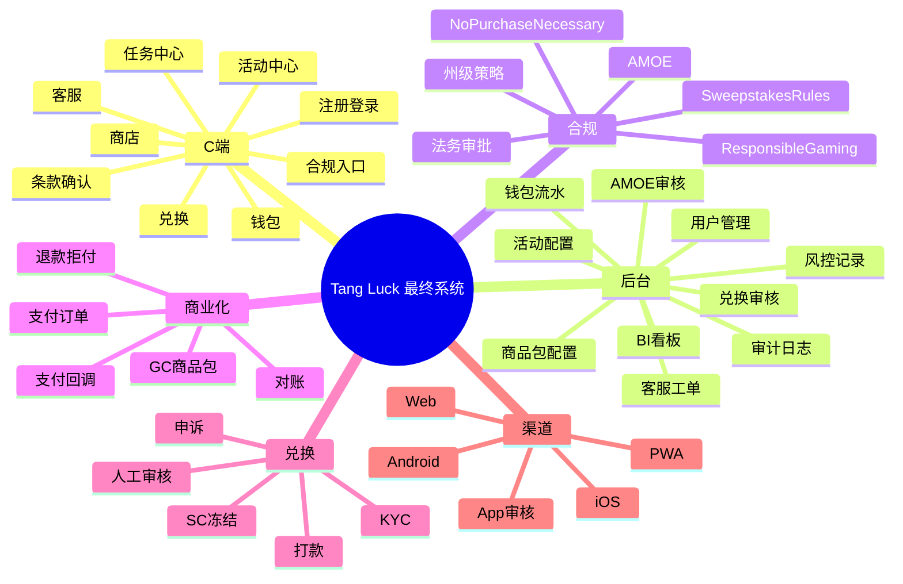
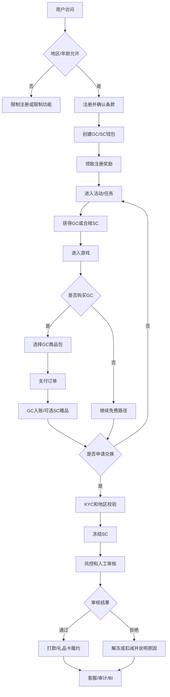
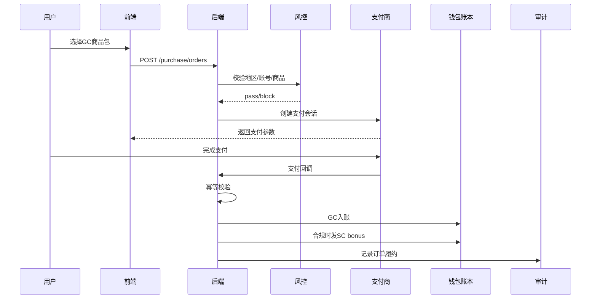
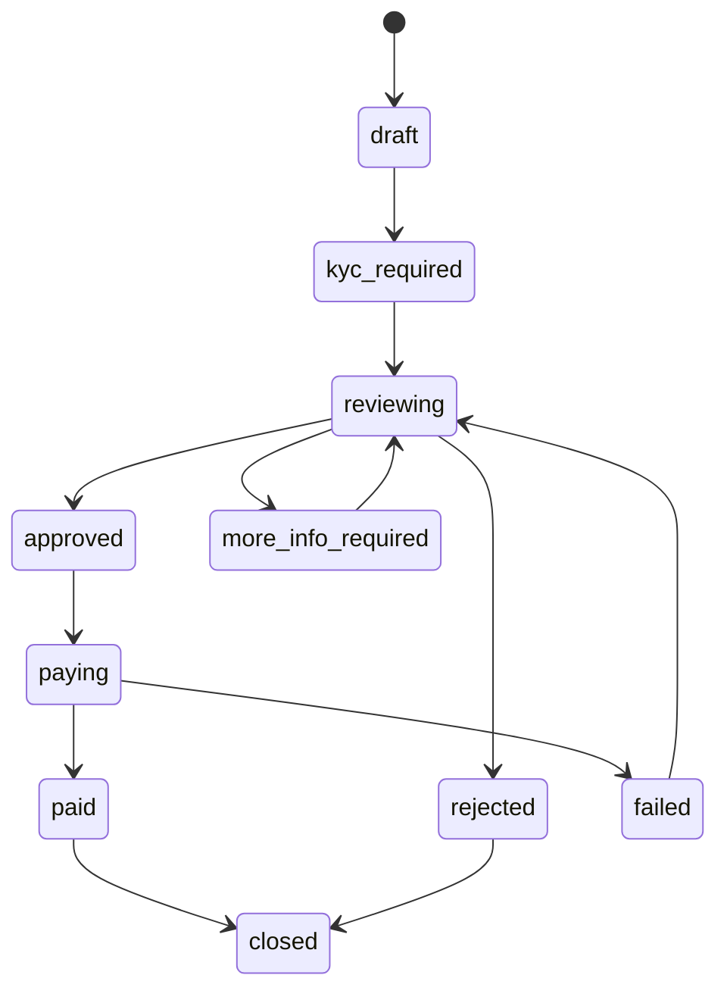
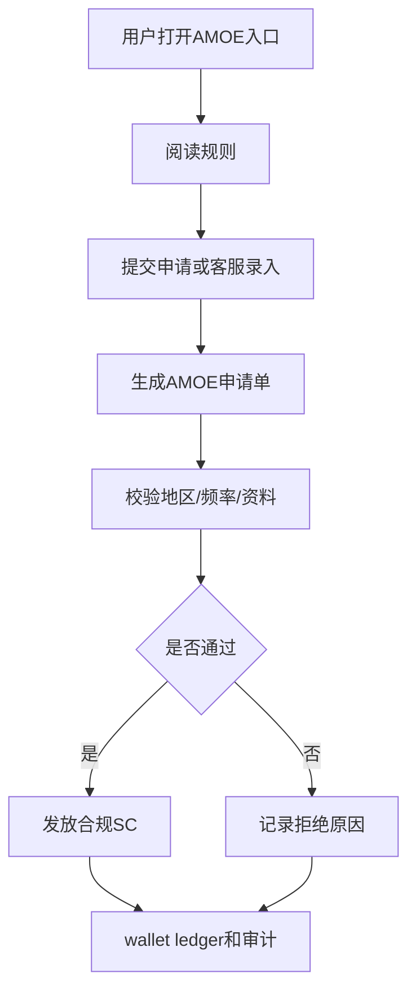

# Tang Luck 可运营可评审可验收最终 PRD

## 1. 文档信息

| 项目 | 内容 |
| --- | --- |
| 文档名称 | Tang Luck 可运营可评审可验收最终 PRD |
| 文档版本 | v1.0 |
| 适用阶段 | 15 天竞标交付、MVP 补齐、可运营 1.0、成熟运营 |
| 适用角色 | 客户决策层、产品、运营、研发、QA、客服、风控、法务、支付商务、App 上架负责人 |
| 文档目标 | 形成一份可评审、可开发、可运营、可验收的最终落地文档 |
| 重要边界 | 本文是产品和研发落地方案，不构成法律意见；美国州级开放、SC 发放、AMOE、GC 购买、兑换、支付、App 上架必须由美国律师、支付商和平台审核团队最终确认 |

## 2. 一句话结论

Tang Luck 应按 **Sweepstakes Social Casino** 的最终合规架构建设，而不是按普通 Slots App 或临时 Demo 建设。

15 天版本只交付 **P0-A：合规活动运营最小闭环**，必须真实跑通注册、条款、GC/SC 钱包、活动、奖励、SC 合规开关、免费入口、审计和看板；购买、KYC、真实兑换、App 提审放到 P1，但从 P0-A 就预留最终数据结构和配置口径。

## 3. 总体系统脑图



## 4. 版本路线图

| 阶段 | 定位 | 必须交付 | 不做/灰态 | 通过标准 |
| --- | --- | --- | --- | --- |
| P0-A / 15 天 | 竞标交付和底座验证 | 注册、条款、GC/SC 钱包、`wallet_ledger`、注册赠送、每日登录、每日任务、Coupon、SC 开关、No Purchase Necessary、AMOE 静态页、后台活动、看板、审计 | 购买、KYC、真实兑换、App 提审灰态或预留 | 主链路 5 分钟可演示，后台可配置活动，所有发奖可追溯 |
| P0-B / MVP 补齐 | 形成可信闭环 | 游戏入口、兑换申请、SC 冻结、客服工单、AMOE 申请、活动规则快照、人工审核 | 自动打款、复杂支付、自动风控 | 用户可提交兑换/AMOE，客服和后台可处理 |
| P1 / 可运营 1.0 | 小规模真实运营 | GC 商品包、支付订单、支付回调、退款拒付、KYC、真实兑换、邀请、排行榜、转盘、会员基础、App 上架材料 | 自动放量、高复杂 VIP | 小流量用户可完成注册、领奖、购买、KYC、兑换、客服 |
| P2 / 成熟运营 | 放量和长期运营 | 自动风控、用户分层、A/B 测试、支付冗余、VIP 增强、运营日历、BI/LTV | - | 运营可按数据持续优化，风险和客服可控 |

## 5. 完整业务主链路



## 6. 角色与权限

| 角色 | 主要权限 | 不允许 |
| --- | --- | --- |
| 普通用户 | 注册、领奖、玩游戏、查看钱包、申请兑换、联系客服、查看规则 | 绕过地区、KYC、风控限制 |
| 运营 | 配置活动、任务、Coupon、商品展示、看板复盘 | 直接发布高风险 SC 活动 |
| 客服 | 查询用户、订单、钱包、兑换、工单；按额度补偿 GC | 一线直接补发 SC 或现金价值奖励 |
| 风控 | 查看风险记录、冻结账号、标记风险、审核兑换 | 修改钱包余额不留痕 |
| 财务/支付 | 查看订单、退款、拒付、对账 | 手工入账不走 ledger |
| 法务/合规 | 审核规则、地区、SC 策略、AMOE、商品包文案 | 直接改用户资产 |
| 管理员 | 用户、活动、合规、支付、兑换、审计全局管理 | 删除审计日志 |

## 7. 美国合规配置标准

### 7.1 核心原则

| 原则 | 产品标准 |
| --- | --- |
| No Purchase Necessary | 免费参与路径必须是独立入口，不得只藏在规则长文中 |
| 购买不提高中奖机会 | 用户购买 GC 不应成为获得 SC、奖品或兑换资格的唯一方式 |
| 不卖 SC | 商品、订单、收据、按钮都不能表达为购买 SC |
| 州级控制 | 美国不能只配 `country=US`，必须至少到 `state_code` |
| 规则版本化 | Terms、Sweepstakes Rules、AMOE、Privacy、Responsible Gaming 必须版本化 |
| 发奖可追溯 | 所有 GC/SC 变动必须写入 `wallet_ledger` |

### 7.2 合规配置字段

| 表/配置 | 字段 | 说明 |
| --- | --- | --- |
| `compliance_regions` | `country_code`、`state_code`、`registration_allowed`、`game_allowed`、`purchase_allowed`、`sc_grant_allowed`、`redemption_allowed`、`amoe_allowed`、`requires_legal_review` | 州级开关 |
| `compliance_documents` | `document_type`、`version`、`content_url`、`effective_at`、`legal_approval_id`、`status` | 规则 CMS |
| `user_consent_logs` | `user_id`、`document_type`、`version`、`accepted_at`、`ip`、`device_id` | 用户确认记录 |
| `sc_policy_rules` | `policy_code`、`daily_cap`、`user_cap`、`allowed_regions`、`risk_action`、`legal_approval_id` | SC 发放策略 |
| `prize_pool_counters` | `region`、`campaign_id`、`period`、`prize_value_usd`、`threshold_usd`、`alert_status` | 州级奖池预警 |

### 7.3 合规入口

| 入口 | P0-A | P1 |
| --- | --- | --- |
| Terms of Use | 注册页、页脚 | CMS 版本化 |
| Sweepstakes Rules | 页脚、活动页 | 每活动规则快照 |
| Privacy Policy | 注册页、页脚 | 多语言/多州版本 |
| No Purchase Necessary | 页脚、活动页、钱包页 | 商店页强制展示 |
| AMOE | 静态说明页 | 申请、审核、状态查询 |
| Responsible Gaming | 页脚预留 | 自我限制、冷静期、帮助入口 |

## 8. SC 发放合规矩阵

| 场景 | 默认奖励 | SC 策略 | 是否可默认发 SC | 法务确认 |
| --- | --- | --- | --- | --- |
| 注册赠送 | GC + 小额 SC | `default_small_sc` | 可，受地区/额度/风险限制 | 额度和州级开放需确认 |
| 每日登录 | GC + 小额 SC | `default_small_sc` | 可，额度低于注册赠送 | 频率和额度需确认 |
| 每日任务 | GC、经验、小额 SC | `gc_only` 或 `default_small_sc` | 低风险任务可 | 任务类型需确认 |
| 查看规则/免费入口 | GC | `gc_only` | 否 | 文案需确认 |
| Coupon | GC、Coupon | `gc_only` | 否 | 发 SC 必须确认 |
| AMOE | SC | `legal_required` | 否 | 必须确认 |
| 邀请奖励 | GC、经验、Coupon | `gc_only` | 否 | 发 SC 必须确认并披露激励 |
| 排行榜 | GC、徽章、经验 | `gc_only` | 否 | 发 SC/高价值奖品必须确认 |
| 转盘 | GC、Coupon、小额 SC | `legal_required` | 不默认开启 | 概率、奖池、免费次数必须确认 |
| 会员/VIP | GC、权益 | `gc_only` | 否 | 涉及兑换权益需确认 |
| GC 商品包赠品 | GC + 可选 SC bonus | `legal_required` | 不默认开启 | 商品文案和州级开放必须确认 |

## 9. 活动与任务

### 9.1 P0-A 活动

| 活动 | 入口 | 规则 | 默认奖励 | 风控 |
| --- | --- | --- | --- | --- |
| 注册赠送 | 注册成功弹窗、活动中心 | 每用户一次，必须完成年龄/条款确认 | GC + 小额 SC | 同设备/IP 多账号只发 GC 或拦截 |
| 每日登录 | 首页、活动中心 | 每日一次，按用户时区或统一 UTC | GC + 小额 SC | 风险用户只发 GC |
| 每日任务 | 任务页 | 3-5 个任务，完成后领取 | GC、经验、少量 SC | 购买/兑换/输赢不作为 SC 条件 |
| Coupon | Coupon 页、客服补偿 | code、批次、用户、设备限制 | 默认 GC/Coupon | 撞库和批量领取拦截 |

### 9.2 P1/P2 活动

| 活动 | 上线阶段 | 默认奖励 | SC 策略 | 注意事项 |
| --- | --- | --- | --- | --- |
| 邀请奖励 | P1 | GC、经验、Coupon | 默认只发 GC | 防多账号、需披露激励 |
| 排行榜 | P1 | GC、徽章、经验 | 默认只发 GC | 榜单冻结后风控审核 |
| 转盘 | P1 | GC、Coupon、小额 SC | 必须法务确认 | 概率、库存、免费次数可见 |
| 会员 | P1 | GC、权益、客服优先 | 默认只发 GC | 不得绕过 KYC/风控 |
| 运营日历 | P2 | GC、Coupon、小额 SC | 分活动审批 | 提前配置预算和规则 |

### 9.3 活动配置字段

| 字段 | 说明 |
| --- | --- |
| `campaign_id` | 活动 ID |
| `campaign_type` | register、daily_login、daily_task、coupon、invite、leaderboard、wheel、amoe |
| `eligible_regions` / `blocked_regions` | 州级地区 |
| `reward_policy` | GC、SC、经验、Coupon |
| `sc_strategy` | `gc_only`、`default_small_sc`、`legal_required`、`sc_blocked` |
| `budget_cap` / `daily_budget_cap` / `user_period_cap` | 预算与用户上限 |
| `rules_version` | 活动规则版本 |
| `legal_approval_id` | 涉及 SC、随机、奖池、AMOE 时必填 |
| `risk_action` | pass、gc_only、delay、manual_review、block |

### 9.4 活动发布验收

```gherkin
Feature: 活动合规发布
  Scenario: 涉及 SC 的活动缺少法务审批
    Given 运营创建一个发放 SC 的活动
    And legal_approval_id 为空
    When 运营点击发布
    Then 系统阻断发布
    And 提示需要法务审批和规则版本

  Scenario: 禁止州用户领取活动
    Given 用户所在地属于 blocked_regions
    When 用户点击领取
    Then 后端拒绝发放 SC
    And 记录 risk_event
```

## 10. GC 商品包与购买

### 10.1 合规原则

| 原则 | 标准 |
| --- | --- |
| 购买对象 | 只能是 Gold Coins |
| 按钮文案 | `Buy Gold Coins`，不使用 `Buy SC` |
| SC bonus | 只能作为促销赠品单独展示，默认关闭 |
| 免费路径 | 商店页必须展示 No Purchase Necessary / AMOE |
| 地区 | 商品包按州控制展示和购买 |
| 支付商 | 未获得支付商准入前不接真实支付 |

### 10.2 商品包字段

| 字段 | 说明 |
| --- | --- |
| `package_id` | 商品包 ID |
| `package_name` | Gold Coins Pack |
| `gc_amount` | GC 数量 |
| `price_usd` | 价格 |
| `sc_bonus_enabled` | 是否启用 SC 赠品 |
| `sc_bonus_amount` | SC 赠品数量 |
| `legal_approval_id` | 启用 SC bonus 时必填 |
| `eligible_regions` / `blocked_regions` | 州级控制 |
| `no_purchase_url` | 免费获取说明 |
| `status` | draft、reviewing、active、paused |

### 10.3 购买时序图



### 10.4 购买验收

| 场景 | 验收标准 |
| --- | --- |
| 支付成功 | 订单 `fulfilled`，GC 入账，ledger 可追溯 |
| 支付失败 | 订单 `failed`，不入账 |
| 重复回调 | 不重复发 GC/SC |
| 禁止州 | 前端隐藏入口，后端拒绝订单 |
| 退款 | 生成退款单，GC 冲正或冻结 |
| 拒付 | 生成拒付单，限制兑换并触发风控 |

## 11. 兑换、KYC 与打款

### 11.1 兑换状态机



### 11.2 兑换规则

| 项目 | 标准 |
| --- | --- |
| 兑换入口 | P0-A 灰态，P0-B 提交申请，P1 完整履约 |
| KYC | 真实兑换前必须完成 |
| 地区 | `redemption_allowed=false` 的州不可兑换 |
| SC 冻结 | 提交申请后冻结对应 SC |
| 审核 | P0-B/P1 默认人工审核 |
| 打款 | P1 接供应商或人工履约 |
| SLA | 展示审核和到账预期，不承诺保证到账 |
| 申诉 | 拒绝/失败后支持客服工单 |

### 11.3 兑换字段

| 字段 | 说明 |
| --- | --- |
| `redemption_id` | 兑换单 ID |
| `user_id` | 用户 ID |
| `sc_amount` | 兑换 SC 数量 |
| `cash_value` | 对应价值 |
| `status` | 状态 |
| `kyc_status` | KYC 状态 |
| `region_snapshot` | 地区快照 |
| `frozen_ledger_id` | 冻结流水 |
| `risk_score` | 风险评分 |
| `reviewer_id` | 审核人 |
| `payout_status` | 打款状态 |

## 12. AMOE 与免费路径

| 能力 | P0-A | P0-B/P1 |
| --- | --- | --- |
| No Purchase Necessary | 静态入口，页脚/活动页/钱包页展示 | 商店页强制展示 |
| AMOE 规则 | 静态说明页 | CMS 版本化 |
| AMOE 申请 | 占位或客服说明 | 表单/邮寄/客服录入 |
| AMOE 审核 | 不做 | 后台审核、拒绝原因、SC 发放 |
| AMOE 状态 | 不做 | 用户可查询状态 |



## 13. App 上架

### 13.1 iOS

| 项目 | 标准 |
| --- | --- |
| 规则展示 | App 内展示 Sweepstakes Rules、No Purchase Necessary、AMOE |
| Apple 免责声明 | 规则中说明 Apple 不是赞助方或参与方 |
| 支付策略 | IAP、外部支付或 Web/PWA 购买方案必须提前确认 |
| 年龄分级 | 按 simulated gambling / sweepstakes 内容设置 |
| 地区限制 | App Store Connect 地区 + App 内州级限制 |
| 审核账号 | 提供可看首页、钱包、活动、规则、商店、兑换灰态的账号 |

### 13.2 Android / Google Play

| 项目 | 标准 |
| --- | --- |
| 受限品类评估 | 按 Real-Money Gambling, Games, and Contests 政策准备材料 |
| 地理围栏 | 未开放地区必须阻止访问相关功能 |
| 年龄限制 | 未成年人不得购买、获取 SC 或兑换 |
| 支付说明 | 明确购买对象为 GC |
| 商店文案 | 禁止赚钱、提现、真钱博彩诱导 |
| Responsible Gaming | 商店页和 App 内提供责任博彩/娱乐说明 |

### 13.3 上架材料

| 材料 | 是否必须 |
| --- | --- |
| 审核账号 | 必须 |
| 业务说明 | 必须 |
| Sweepstakes Rules 链接 | 必须 |
| No Purchase Necessary / AMOE | 必须 |
| 地区限制说明 | 必须 |
| 年龄限制说明 | 必须 |
| 支付说明 | 必须 |
| Privacy Policy | 必须 |
| 下架应急方案 | 建议 |

## 14. 支付

| 能力 | 标准 |
| --- | --- |
| 支付商准入 | 开发真实支付前完成业务模式披露和审批 |
| 商品描述 | 只写 Gold Coins Pack |
| 订单 | `purchase_orders` 保存金额、商品快照、地区、状态 |
| 回调 | `payment_events` 做幂等 |
| 退款 | `refund_orders`，冲正或冻结余额 |
| 拒付 | `chargeback_cases`，限制购买/兑换 |
| 对账 | 支付商金额、订单金额、wallet ledger 一致 |
| 备用通道 | P2 建议至少一个备选支付方案 |

支付商准入材料：

| 材料 | 说明 |
| --- | --- |
| 公司和商户资料 | 主体、税务、银行账户 |
| 产品说明 | GC/SC 双币、购买对象、SC bonus、兑换规则 |
| 合规文件 | Terms、Rules、No Purchase Necessary、AMOE |
| 地区策略 | 开放州、禁止州、KYC/支付地址校验 |
| 风控策略 | 注册、购买、退款、拒付、兑换 |
| 客服和退款政策 | 投诉、退款、拒付 SOP |

## 15. 风控

| 场景 | 动作 |
| --- | --- |
| 批量注册 | 限制注册奖励，只发 GC 或拦截 |
| 代理/VPN | 拦截 SC、购买、兑换 |
| 邀请套利 | 设备/IP/KYC/支付方式关联 |
| Coupon 撞库 | 限制尝试次数和验证码 |
| 排行榜刷榜 | 榜单冻结后审核再发奖 |
| 购买拒付 | 限制兑换，余额冲正 |
| 兑换欺诈 | KYC、地址、支付、设备综合评分 |

风控动作矩阵：

| 风险等级 | 活动 | 购买 | 兑换 | 客服补偿 |
| --- | --- | --- | --- | --- |
| low | 正常 | 允许 | 常规审核 | 正常 |
| medium | SC 延迟或只发 GC | 允许但监控 | 人工审核 | 主管审批 |
| high | 不发 SC | 限制 | 禁止或强审核 | 不发 SC |
| blocked | 不发奖励 | 禁止 | 禁止 | 禁止 |

## 16. 客服与运营 SOP

| 工单类型 | 查询内容 | 处理标准 |
| --- | --- | --- |
| 奖励未到账 | 活动记录、发奖记录、ledger | 可补发 GC；补发 SC 需审批 |
| 支付未到账 | 订单、支付事件、ledger | 支付成功未入账走补偿队列 |
| 退款/拒付 | 订单、退款单、拒付单 | 限制兑换并说明原因 |
| KYC 失败 | KYC 结果、失败原因 | 提供重新提交或申诉 |
| 兑换延迟 | 兑换状态、审核记录、打款记录 | 展示 SLA，不承诺保证到账 |
| AMOE 咨询 | AMOE 申请、处理状态 | 按规则处理并留痕 |
| 地区限制 | IP、KYC 地址、支付地址 | 说明开放地区规则 |

## 17. 数据模型

| 表 | 用途 |
| --- | --- |
| `users` | 用户 |
| `user_consent_logs` | 条款确认 |
| `compliance_regions` | 州级合规 |
| `compliance_documents` | 规则 CMS |
| `wallet_accounts` | 钱包余额 |
| `wallet_ledger` | 钱包流水 |
| `promotion_campaigns` | 活动配置 |
| `promotion_claims` | 领取记录 |
| `promotion_reward_grants` | 发奖记录 |
| `coupon_codes` | Coupon |
| `product_packages` | GC 商品包 |
| `purchase_orders` | 购买订单 |
| `payment_events` | 支付回调 |
| `refund_orders` | 退款 |
| `chargeback_cases` | 拒付 |
| `redemption_requests` | 兑换申请 |
| `kyc_profiles` | KYC |
| `amoe_requests` | AMOE |
| `support_tickets` | 客服 |
| `risk_events` | 风控 |
| `audit_logs` | 审计 |

## 18. API 建议

| 接口 | 方法 | 用途 |
| --- | --- | --- |
| `/auth/register` | POST | 注册 |
| `/auth/login` | POST | 登录 |
| `/compliance/documents` | GET | 合规文档 |
| `/wallet/summary` | GET | 钱包余额 |
| `/wallet/ledger` | GET | 钱包流水 |
| `/campaigns` | GET | 活动列表 |
| `/campaigns/{id}/claim` | POST | 活动领取 |
| `/tasks/daily` | GET | 每日任务 |
| `/tasks/{id}/claim` | POST | 任务领奖 |
| `/coupon/claim` | POST | Coupon |
| `/purchase/packages` | GET | 商品包 |
| `/purchase/orders` | POST | 创建购买订单 |
| `/payment/webhook/{provider}` | POST | 支付回调 |
| `/redemptions` | POST | 提交兑换 |
| `/amoe/requests` | POST | AMOE 申请 |
| `/support/tickets` | POST | 工单 |
| `/admin/campaigns` | POST/PUT | 活动后台 |
| `/admin/redemptions` | GET/PUT | 兑换审核 |
| `/admin/dashboard` | GET | 看板 |

## 19. BI 指标

| 指标 | P0-A | P0-B | P1 |
| --- | --- | --- | --- |
| 注册数/转化率 | 必须 | 必须 | 必须 |
| 条款确认率 | 必须 | 必须 | 必须 |
| 活动领取率 | 必须 | 必须 | 必须 |
| GC/SC 发放总量 | 必须 | 必须 | 必须 |
| SC 来源分布 | 必须 | 必须 | 必须 |
| 风控拦截数 | 必须 | 必须 | 必须 |
| AMOE 点击/申请 | 点击 | 申请 | 申请和处理时长 |
| 兑换点击/申请 | 点击 | 申请 | 申请到打款漏斗 |
| KYC 通过率 | 不做 | 预留 | 必须 |
| 支付成功率 | 不做 | 预留 | 必须 |
| 退款/拒付率 | 不做 | 预留 | 必须 |
| 客服投诉率 | 基础 | 必须 | 必须 |

## 20. 15 天开发排期

| 时间 | 研发重点 | 产品/运营重点 | 验收标准 |
| --- | --- | --- | --- |
| D1-D2 | 表结构、接口、页面框架 | 冻结 P0-A 范围、规则文案 | 范围不再扩散 |
| D3-D5 | 注册、条款、钱包、ledger | 奖励额度、合规入口 | 用户可注册、查看钱包 |
| D6-D8 | 活动领取、发奖、任务、Coupon | 活动配置样例 | 3 类活动可领取 |
| D9-D11 | 后台活动、SC 开关、审计 | 后台验收 | 运营可配置并上线活动 |
| D12-D13 | 风控、看板、客服入口 | 风控演示场景 | 风险用户只发 GC 或拦截 |
| D14-D15 | 联调、修复、演示数据 | 彩排和评审材料 | 主链路稳定演示 |

## 21. 验收标准

### 21.1 P0-A 必须通过

```gherkin
Feature: P0-A 最小闭环
  Scenario: 新用户注册并领取奖励
    Given 用户在允许地区
    When 用户完成注册和条款确认
    Then 系统创建 GC/SC 钱包
    And 发放注册奖励
    And wallet_ledger 可查询来源

  Scenario: 风险用户领取活动
    Given 用户命中风险规则
    When 用户领取每日登录奖励
    Then 系统不发 SC 或只发 GC
    And 记录 risk_event

  Scenario: 运营发布 SC 活动
    Given 活动包含 SC 奖励
    And legal_approval_id 为空
    When 运营点击发布
    Then 系统阻断发布
```

### 21.2 P1 必须通过

| 模块 | 验收标准 |
| --- | --- |
| GC 购买 | 支付成功、失败、重复回调、退款、拒付全部可处理 |
| KYC | 通过、失败、补充资料、申诉流程可跑通 |
| 兑换 | 状态机完整，冻结、审核、打款、失败可追踪 |
| App 上架 | 审核账号、规则页、地区限制、支付说明准备完成 |
| 支付 | 支付商准入确认，账务对账一致 |

## 22. 上线前检查清单

| 检查项 | P0-A | P0-B | P1 |
| --- | --- | --- | --- |
| 州级合规配置 | 必须 | 必须 | 必须 |
| GC/SC 钱包和 ledger | 必须 | 必须 | 必须 |
| Terms / Rules / Privacy | 必须 | 必须 | 必须 |
| No Purchase Necessary | 必须 | 必须 | 必须 |
| AMOE 入口 | 静态 | 流程 | 完整 |
| 活动后台 | 必须 | 审计增强 | 审批流 |
| SC 发放开关 | 必须 | 必须 | 必须 |
| 兑换申请 | 灰态 | 必须 | 完整 |
| KYC | 不做 | 预留 | 必须 |
| GC 购买 | 预留 | 灰态 | 必须 |
| 支付退款拒付 | 不做 | 预留 | 必须 |
| App 上架材料 | 预研 | 准备 | 提审 |
| 客服 SOP | 基础 | 必须 | 完整 |
| BI 看板 | 基础 | 漏斗 | ROI/LTV |

## 23. 客户、法务、支付、App 确认项

| 类型 | 必须确认 |
| --- | --- |
| 客户 | 开放州、首批活动、奖励额度、兑换门槛、Web/PWA 兜底 |
| 法务 | 州级策略、Rules、No Purchase Necessary、AMOE、SC 发放、商品包 SC bonus、NY/FL 阈值 |
| 支付商 | 是否接受 sweepstakes/social casino，是否允许 GC 商品包，退款/拒付规则 |
| App 审核 | iOS 支付策略、Android 受限品类、审核账号、商店文案、地区限制 |

## 24. 公开参考来源

| 来源 | 产品影响 |
| --- | --- |
| [Apple App Review Guidelines](https://developer.apple.com/app-store/review/guidelines/) | Sweepstakes/contest 规则需在 App 内展示，Apple 不应被表述为赞助方或参与方；IAP 与真钱游戏币种需谨慎 |
| [Google Play Real-Money Gambling, Games, and Contests](https://support.google.com/googleplay/android-developer/answer/9877032?hl=en) | 对真钱游戏、奖品、比赛类 App 有地区、年龄、分级、支付和责任博彩要求 |
| [Google Play common violations for gambling apps](https://support.google.com/googleplay/android-developer/answer/13381106?hl=en) | 强调地理围栏和未授权地区拦截 |
| [FTC Lottery & Sweepstakes](https://www.ftc.gov/lottery-sweepstakes) | 避免误导性 sweepstakes 和 prize promotion 表达 |
| [FTC Fake Prize, Sweepstakes, and Lottery Scams](https://consumer.ftc.gov/articles/fake-prize-sweepstakes-and-lottery-scams) | 不得要求用户付费领取奖品或制造官方背书错觉 |
| [USPIS Consumer's Guide to Sweepstakes and Lotteries](https://www.uspis.gov/wp-content/uploads/2019/12/pub-546_consumers-guide-to-sweepstakes-lotteries_508.pdf) | No Purchase Necessary、购买不应提高中奖机会 |
| [Florida FDACS Game Promotions/Sweepstakes](https://www.fdacs.gov/Business-Services/Game-Promotions-Sweepstakes) | Florida 大额 game promotion 可能触发 filing、规则、信托或保证金 |
| [Florida Statutes 849.094](https://www.leg.state.fl.us/statutes/index.cfm?App_mode=Display_Statute&URL=0800-0899%2F0849%2FSections%2F0849.094.html) | Florida game promotion 相关法条 |
| [New York Department of State Games of Chance Registration](https://dos.ny.gov/games-chance-registration) | New York 大额机会类促销可能触发注册、保证金等要求 |
| [Stripe Restricted Businesses](https://stripe.com/en-br/legal/restricted-businesses) | 带 monetary/material prize 的 games of chance、sweepstakes、contest 属高风险限制范围 |
| [PayPal Acceptable Use Policy](https://www.paypal.com/us/legalhub/paypal/acceptableuse-full) | Gambling、gaming、prize draws、contests 等需符合法律和平台政策，通常需预先评估 |

## 25. 最终建议

1. 15 天版本必须做最终架构的 P0-A，不做临时 Demo。
2. P0-A 不接真实支付、KYC、真实兑换，但必须预留最终表结构和接口命名。
3. 所有 SC 发放必须经过地区、风险、预算、规则版本和法务审批 ID 校验。
4. 所有购买链路都必须表达为 GC 商品包，SC 只能作为促销赠品且默认关闭。
5. P0-B 先补兑换申请、AMOE 申请、客服和人工审核，再进入 P1 的支付/KYC/App 上架。
6. 支付商准入、App 审核和美国州级合规必须提前推进，不能等开发完成后再确认。
