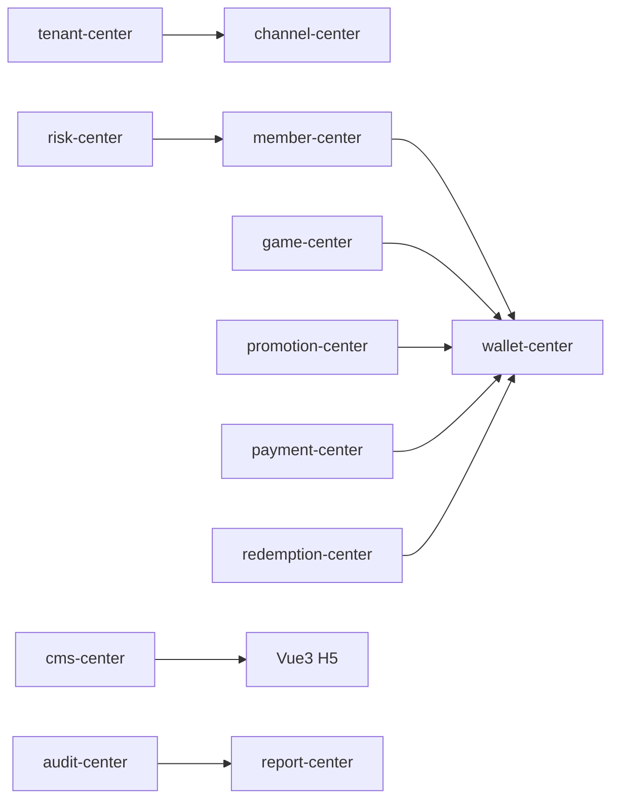

# 模块拆分

## 1. 总览

第一阶段采用模块化单体优先，不急于拆微服务。

推荐后端模块：

```text
tenant-center
channel-center
member-center
wallet-center
game-center
promotion-center
payment-center
redemption-center
risk-center
cms-center
report-center
audit-center
```

## 2. 模块职责

| 模块 | P0 职责 | P1 后扩展 |
| --- | --- | --- |
| tenant-center | 租户、品牌、域名、主题基础配置 | 多品牌模板、独立结算、租户套餐 |
| channel-center | H5/PWA/App 渠道开关 | App Store / Google Play 审核配置 |
| member-center | 玩家账号、状态、标签、KYC 状态 | 会员等级、生命周期、营销标签 |
| wallet-center | 币种、账户、流水、冻结、结算、幂等 | 汇率、清结算、风控限额 |
| game-center | 游戏列表、模拟供应商、投注和派彩回调 | 多供应商、游戏分类、维护窗口 |
| promotion-center | 活动奖励发放 | 任务系统、签到、VIP、礼包 |
| payment-center | 模拟支付订单和回调 | 多支付供应商、对账、拒付处理 |
| redemption-center | 兑换申请、审核、结算、失败退回 | 自动出款、批量审核、风控复核 |
| risk-center | 地区限制、KYC 状态、黑名单 | 设备指纹、行为风控、规则引擎 |
| cms-center | Banner、公告、规则页 | 多语言内容、页面模板 |
| report-center | 基础运营报表 | 留存、渠道、活动、游戏分析 |
| audit-center | 敏感操作日志 | 审计检索、导出、告警 |

## 3. 核心调用方向



## 4. 禁止调用方向

| 来源 | 禁止行为 |
| --- | --- |
| game-center | 禁止直接更新钱包账户余额 |
| promotion-center | 禁止绕过 wallet-center 发奖励 |
| payment-center | 禁止未验签或未确认订单时入账 |
| redemption-center | 禁止审核前直接扣减余额 |
| H5 / Flutter | 禁止调用任何内部账务接口 |
| Cocos | 禁止直接调用 wallet-center |

## 5. P0 模块优先级

| 优先级 | 模块 |
| --- | --- |
| P0-A | tenant-center、channel-center、wallet-center、member-center |
| P0-B | game-center、promotion-center、redemption-center |
| P0-C | payment-center、risk-center、audit-center、report-center |
| P0-D | cms-center、Vue3 H5、Flutter App、Cocos 预留 SDK |

## 6. 推荐开发样板

每个业务模块至少包含：

```text
domain model
request DTO
response VO
service
mapper
controller
permission code
menu entry
unit or integration test
```

钱包、支付、兑换、游戏回调模块还必须包含：

```text
idempotency key
business order number
ledger record
audit log
failure reason
retry-safe behavior
```
