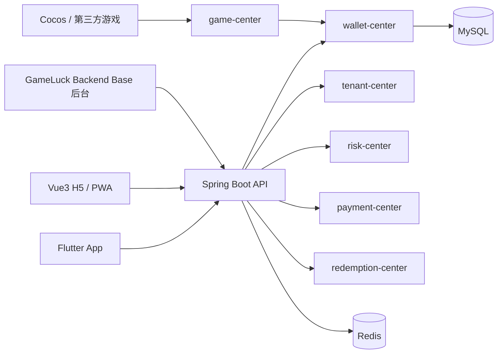

# 包网平台底座架构设计

## 1. 文档信息

| 项目 | 内容 |
| --- | --- |
| 文档日期 | 2026-06-25 |
| 适用阶段 | 项目底座设计 / MVP 前置设计 |
| 业务类型 | 包网平台、Social Casino、Sweepstakes、真金扩展 |
| 目标读者 | 产品、后端、前端、App、测试、AI 编码助手 |

## 2. 设计目标

本项目需要建立一个可长期维护、可多租户定制、可多端交付的包网平台底座。

核心目标：

- 支持平台方创建和管理多个租户 / 品牌。
- 支持品牌级配置，包括主题、域名、渠道、游戏、币种、活动、支付、兑换和地区限制。
- 支持 GC、SC、RC 以及后续扩展币种，不把钱包写死成双币。
- 支持 B 端后台、C 端 H5、玩家 App、自研游戏或小游戏接入。
- 明确 AI 开发边界，避免代码散乱和后期不可维护。

## 3. 技术选型

| 层级 | 技术 | 定位 |
| --- | --- | --- |
| B 端后台 | GameLuck Backend Base | 平台总后台、租户后台、运营配置、审核、报表 |
| C 端 H5 | Vue3 + Vite | 品牌官网、H5 玩家入口、PWA、活动页、下载页、政策页 |
| 玩家 App | Flutter | iOS / Android 玩家主 App |
| 自研游戏 | Cocos Creator | 自研游戏、活动小游戏、转盘、刮刮卡、互动玩法 |
| 核心后端 | Spring Boot / Java | 业务 API、钱包、游戏、支付、风控、报表 |
| 数据库 | MySQL | 业务主库 |
| 缓存 | Redis | 会话、配置缓存、锁、幂等、热点数据 |
| 对象存储 | S3 / R2 / OSS 兼容方案 | 图片、活动素材、KYC 文件、导出文件 |

## 4. 系统边界

### 4.1 GameLuck Backend Base

负责：

- 平台总后台。
- 租户 / 品牌管理。
- 后台用户、角色、菜单、权限。
- 参数、字典、配置。
- 会员、钱包、支付、兑换、活动、游戏、报表的运营后台页面。
- 审计日志和敏感操作记录。

不负责：

- 玩家 C 端页面。
- App UI。
- 自研游戏渲染。
- 钱包核心账务计算的前端实现。

### 4.2 Vue3 H5

负责：

- 品牌官网。
- H5 玩家入口。
- PWA。
- 活动页、推广页、下载页。
- 帮助中心、FAQ、政策页、规则页。
- 支付中转页、KYC 页面、客服脚本、埋点脚本接入。

不负责：

- 后台运营管理。
- 钱包余额计算。
- 直接改账。
- 自研游戏本体。

### 4.3 Flutter App

负责：

- 玩家主 App。
- 登录注册、游戏大厅、钱包、充值、兑换、任务、活动、VIP、消息、个人中心。
- iOS / Android 原生能力接入。

不负责：

- SEO 官网。
- 复杂营销落地页矩阵。
- 后台管理功能。
- 钱包核心账务计算。

### 4.4 Cocos Creator

负责：

- 自研游戏。
- 活动小游戏。
- 转盘、刮刮卡、抽奖、互动玩法。

不负责：

- 普通业务页面。
- 登录注册主流程。
- 支付、兑换、KYC。
- 后台管理。

## 5. 后端模块划分

| 模块 | 职责 |
| --- | --- |
| tenant-center | 租户、品牌、域名、主题、包网配置 |
| channel-center | H5、PWA、Android、iOS、Google Play、App Store 渠道能力开关 |
| member-center | 玩家会员、账号、等级、标签、状态 |
| wallet-center | 币种、账户、余额、流水、冻结、结算、兑换规则 |
| game-center | 游戏供应商、游戏列表、游戏启动、投注回调、派彩回调 |
| promotion-center | 活动、任务、签到、礼包、奖励发放 |
| payment-center | 支付渠道、充值订单、回调、对账 |
| redemption-center | 兑换申请、审核、出款、失败退回 |
| risk-center | 地区限制、KYC、黑名单、设备、IP、风控规则 |
| cms-center | Banner、公告、FAQ、政策页、活动内容 |
| report-center | 充值、兑换、游戏流水、留存、会员、活动效果 |
| audit-center | 敏感操作、人工调账、审核、配置变更日志 |

## 6. 多币种钱包中心

### 6.1 设计原则

- 不写死 GC、SC、RC 字段。
- 每个会员在每个租户下可拥有多个币种账户。
- 币种能力由平台和租户共同配置。
- 所有余额变动必须产生账变流水。
- 任何业务模块不得直接修改余额。
- 所有扣款、派彩、充值、兑换、冻结、解冻必须支持幂等。
- 真金、兑换、冻结、人工调账必须写审计日志。

### 6.2 初始币种

| 币种 | 类型 | 用途 | 可充值 | 可兑换 / 提现 | 可下注 |
| --- | --- | --- | --- | --- | --- |
| GC | virtual | 娱乐币 | 可配置 | 否 | 可配置 |
| SC | sweepstakes | 奖励币 / Sweepstakes | 可配置 | 可配置 | 可配置 |
| RC | cash | 真金余额 | 可配置 | 可配置 | 可配置 |

### 6.3 后续扩展币种

- BONUS
- VIP_POINT
- PROMO_CREDIT
- FREE_SPIN
- COUPON

### 6.4 建议数据表

| 表 | 用途 |
| --- | --- |
| wallet_currency_config | 平台级币种定义 |
| tenant_currency_config | 租户级币种开关和规则覆盖 |
| member_wallet_account | 会员钱包账户 |
| member_wallet_ledger | 钱包账变流水 |
| wallet_transaction | 业务交易单 |
| wallet_freeze_record | 冻结、解冻、结算记录 |
| wallet_exchange_rule | 币种兑换 / 提现规则 |

### 6.5 钱包调用规则

业务模块只能通过钱包中心接口变更余额：

- 充值成功：`wallet.credit`
- 活动奖励：`wallet.grantBonus`
- 游戏下注：`wallet.debit`
- 游戏派彩：`wallet.credit`
- 兑换申请：`wallet.freeze`
- 兑换失败：`wallet.unfreeze`
- 兑换成功：`wallet.settle`
- 人工调账：`wallet.adjust`

## 7. 渠道开关设计

渠道能力不能写死在前端，应由后台配置返回。

建议渠道：

- H5
- PWA
- Android APK
- Google Play
- iOS App Store
- iOS Enterprise

每个渠道至少支持配置：

- 是否展示 GC。
- 是否展示 SC。
- 是否展示 RC。
- 是否允许充值。
- 是否允许兑换 / 提现。
- 是否展示 KYC。
- 是否展示外部支付。
- 是否展示游戏供应商入口。
- 是否展示活动。
- 是否启用地区限制。
- 是否展示 Sweepstakes Rules。

## 8. Cocos 接入预留

Cocos 只作为游戏或小游戏容器，不承担平台业务。

接入方式：

- Cocos 游戏通过统一 SDK 获取玩家上下文。
- 游戏启动由 `game-center` 创建启动会话。
- 游戏内下注、派彩、奖励通过 `game-center` 转发到 `wallet-center`。
- Cocos 不直接调用钱包余额变更接口。
- Cocos 游戏必须传递业务单号，后端保证幂等。

## 9. 多端数据流

## 10. 第一阶段 MVP 范围

P0 只做最小闭环：

1. 租户 / 品牌管理。
2. 渠道开关。
3. 币种配置。
4. 会员管理。
5. 多币种钱包账户和账变。
6. 游戏列表配置。
7. 模拟游戏下注和派彩回调。
8. 活动奖励发放。
9. 支付订单记录。
10. 兑换申请和后台审核。
11. 基础地区限制和 KYC 状态。
12. 基础报表。

P0 不做：

- 完整 BI 平台。
- 复杂代理分销。
- 自动风控模型。
- 多支付服务商深度集成。
- App Store / Google Play 正式上架。
- 大规模自研游戏内容。

## 11. AI 开发规则

### 11.1 禁止事项

- 禁止修改 GameLuck Backend Base 框架核心包，除非明确说明。
- 禁止绕过权限、租户、数据权限机制。
- 禁止业务模块直接修改钱包余额。
- 禁止在 Controller 中写复杂业务逻辑。
- 禁止直接拼接 SQL。
- 禁止新增未经确认的第三方依赖。
- 禁止大范围重构已有代码。
- 禁止把渠道开关、币种能力、地区规则写死在前端。

### 11.2 后端规则

- Controller 只负责参数接收、权限注解、返回结果。
- Service 负责业务流程。
- Mapper 只负责数据访问。
- 钱包变更必须走 `wallet-center`。
- 数据库变更必须提供 SQL 或 migration。
- 新接口必须说明权限标识、租户隔离、幂等规则。
- 真金、兑换、冻结、人工调账必须写审计日志。

### 11.3 前端规则

- H5、App、后台只能通过 API 获取币种、渠道、功能开关。
- 不允许前端自行判断钱包核心规则。
- 不允许页面直接写死地区合规逻辑。
- 活动页和品牌样式必须走租户 / 品牌配置。
- 复用统一 API 类型和错误码。

### 11.4 交付规则

- 每次只完成一个业务点。
- 修改前说明影响文件。
- 修改后说明接口、菜单、权限、数据库、配置变更。
- 钱包、支付、兑换、游戏回调必须有测试或可验证脚本。

## 12. 待确认事项

| 问题 | 推荐默认值 |
| --- | --- |
| 第一阶段是否启用 RC 真金余额 | 先做配置和账务能力，业务入口可关闭 |
| 是否需要代理 / 渠道分销 | P0 不做，P1 再加 |
| 是否需要正式上架 App Store / Google Play | P0 不做，先 H5/PWA 和测试包 |
| 是否已有游戏供应商 | 先用模拟供应商接口 |
| 是否已有支付 / KYC / 出款服务商 | 先定义适配层，不绑定具体供应商 |

## 13. 验收标准

- 能创建租户和品牌。
- 能配置渠道开关和币种能力。
- 玩家能注册登录并拥有多币种账户。
- 后台能查看会员、钱包、账变、订单、兑换申请。
- 模拟游戏能完成下注和派彩，并产生幂等账变。
- 活动能发放指定币种奖励。
- 兑换申请能冻结余额、审核成功结算、审核失败解冻。
- H5 和 App 均从后端读取渠道和币种配置。
- AI 开发规则能作为后续编码约束使用。
