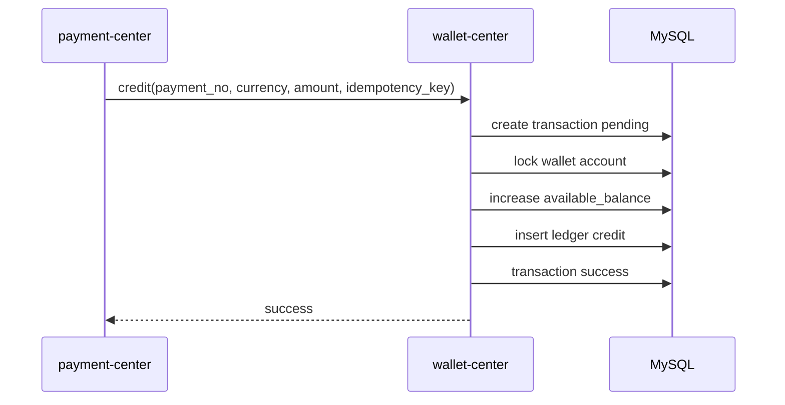
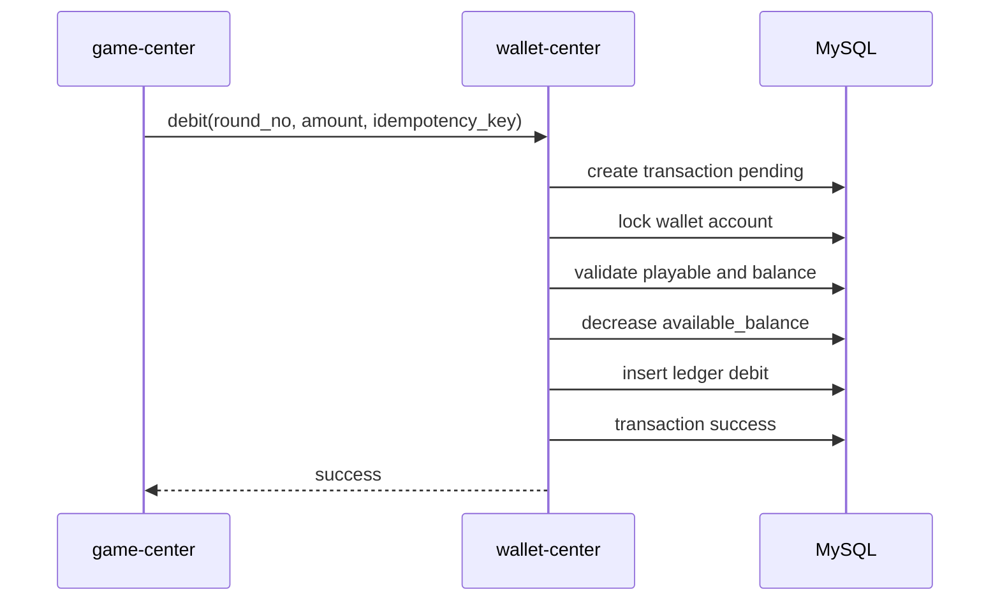
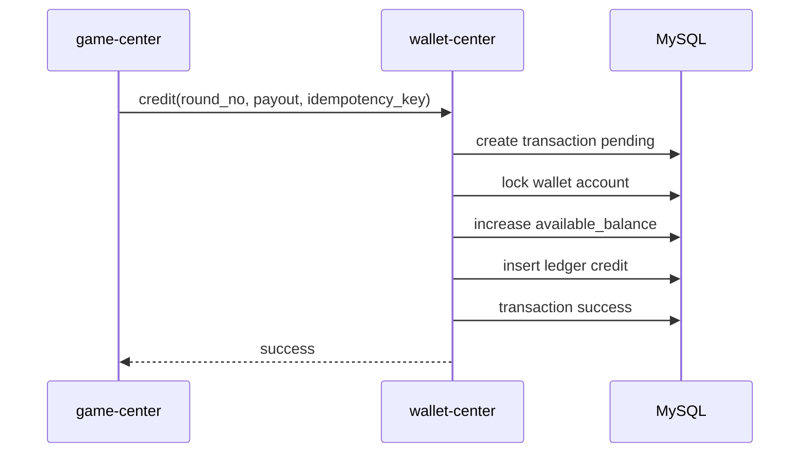
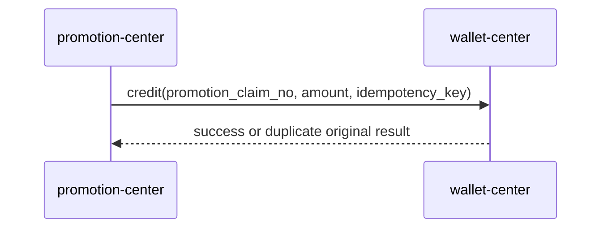
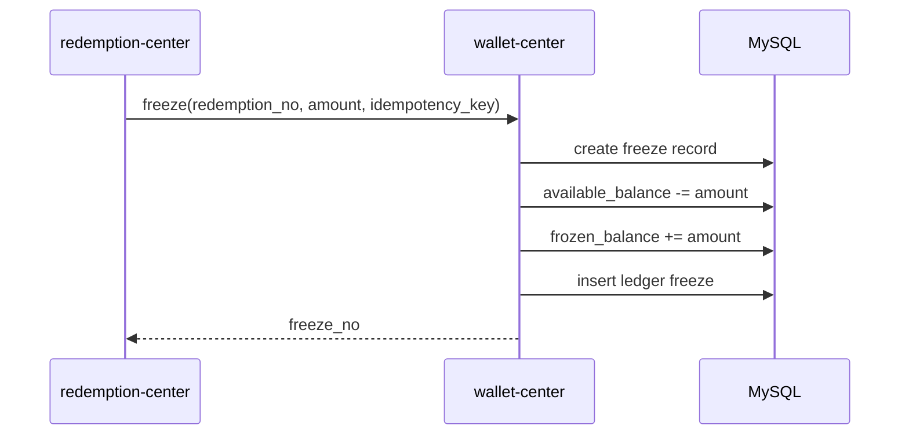
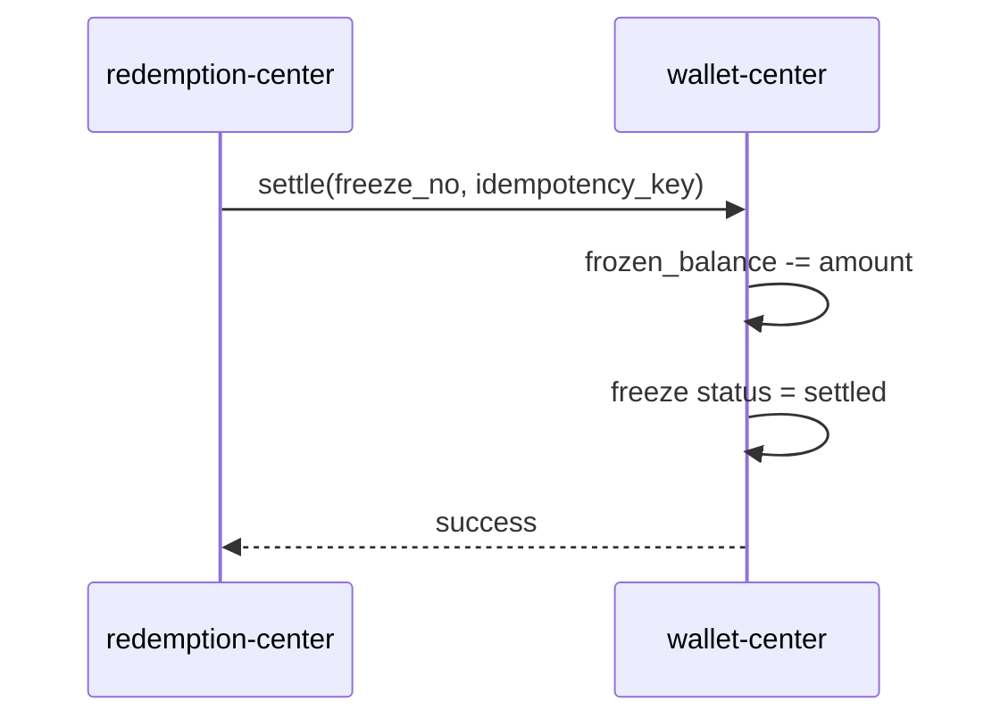
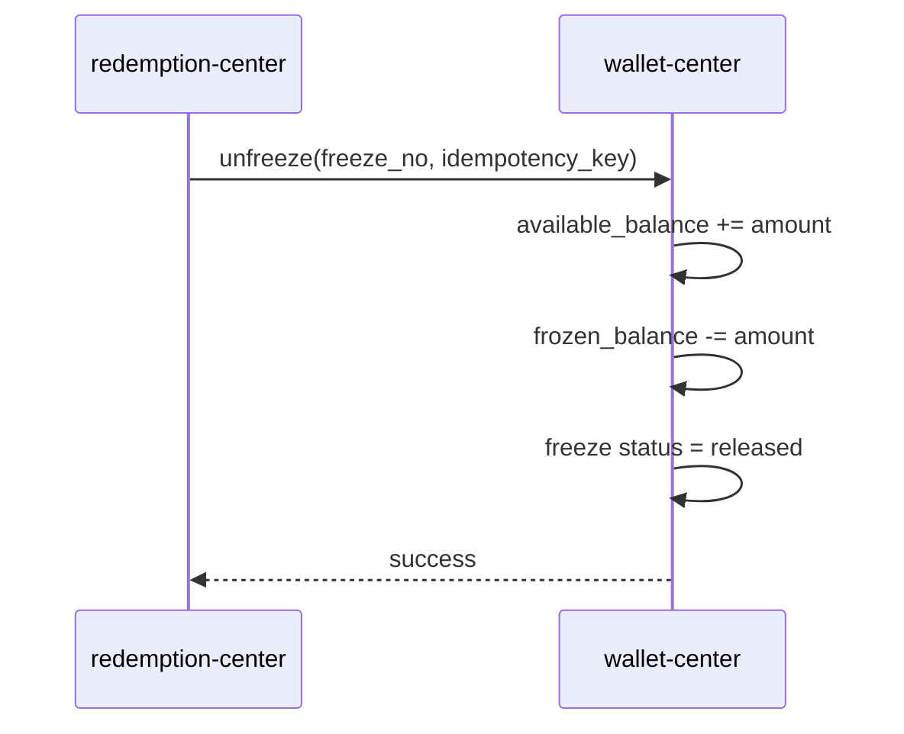

# 钱包中心设计

## 1. 文档信息

| 项目 | 内容 |
| --- | --- |
| 文档日期 | 2026-06-25 |
| 所属系统 | 包网平台 |
| 模块 | wallet-center |
| 适用阶段 | Phase 1 MVP / 钱包核心设计 |

## 2. 设计目标

钱包中心负责所有币种账户、余额、账变、冻结、结算、幂等和冲正能力。

设计目标：

- 支持 GC、SC、RC 以及后续扩展币种。
- 支持租户级币种开关和规则覆盖。
- 支持充值、游戏下注、游戏派彩、活动奖励、兑换冻结、审核结算、人工调账、冲正。
- 所有余额变更必须有账变流水。
- 所有账务操作必须幂等。
- 任何业务模块不得直接修改钱包账户余额。

## 3. 核心模型

钱包中心采用：

```text
账户余额快照 + 账变流水 + 幂等交易单 + 冻结单
```

各模型职责：

| 模型 | 职责 |
| --- | --- |
| 钱包账户 | 保存当前可用余额、冻结余额、账户状态 |
| 账变流水 | 记录每一次余额变化，是账务事实记录 |
| 幂等交易单 | 记录业务请求处理结果，防止重复入账或扣账 |
| 冻结单 | 记录兑换、风控、人工冻结等待结算资金 |
| 币种配置 | 定义币种类型、精度、是否启用 |
| 租户币种配置 | 定义租户下币种能力，如充值、提现、下注、奖励 |

## 4. 状态定义

### 4.1 钱包账户状态

| 状态 | 说明 | 允许操作 |
| --- | --- | --- |
| normal | 正常 | credit、debit、freeze、unfreeze、settle、adjust |
| frozen | 账户冻结 | 只允许 credit、unfreeze、settle、adjust，禁止 debit 和新 freeze |
| disabled | 账户禁用 | 禁止所有玩家侧账务操作，只允许后台审计类 adjust |
| closed | 账户关闭 | 禁止所有账务操作 |

### 4.2 冻结单状态

| 状态 | 说明 | 后续状态 |
| --- | --- | --- |
| frozen | 已冻结，等待审核或处理 | settled、released、expired |
| settled | 已结算，冻结金额已最终扣除 | 终态 |
| released | 已释放，冻结金额回到可用余额 | 终态 |
| expired | 已过期，冻结金额回到可用余额 | 终态 |

### 4.3 交易状态

| 状态 | 说明 |
| --- | --- |
| pending | 已创建，处理中 |
| success | 成功 |
| failed | 失败，未改变余额或已回滚 |
| reversed | 已冲正 |

### 4.4 账变方向

| 方向 | 说明 | 可用余额变化 | 冻结余额变化 |
| --- | --- | --- | --- |
| credit | 入账 | 增加 | 不变 |
| debit | 扣账 | 减少 | 不变 |
| freeze | 冻结 | 减少 | 增加 |
| unfreeze | 解冻 | 增加 | 减少 |
| settle | 结算冻结金额 | 不变 | 减少 |
| adjust | 人工调账 | 增加或减少 | 增加或减少 |
| reverse | 冲正 | 按原交易反向变化 | 按原交易反向变化 |

## 5. 核心操作规则

### 5.1 `credit` 入账

适用场景：

- 充值成功。
- 游戏派彩。
- 活动奖励。
- 人工加款。

规则：

- 账户状态为 `normal` 或 `frozen` 时允许。
- 金额必须大于 0。
- 币种必须启用。
- 请求必须提供 `biz_type`、`biz_no`、`idempotency_key`。
- 成功后增加可用余额并写入账变流水。

### 5.2 `debit` 扣账

适用场景：

- 游戏下注。
- 人工扣款。

规则：

- 账户状态必须为 `normal`。
- 金额必须大于 0。
- 可用余额必须大于等于扣款金额。
- 币种必须允许当前业务使用，例如游戏下注要求 `playable = true`。
- 成功后减少可用余额并写入账变流水。

### 5.3 `freeze` 冻结

适用场景：

- 兑换申请。
- 风控冻结。
- 人工冻结。

规则：

- 账户状态必须为 `normal`。
- 金额必须大于 0。
- 可用余额必须大于等于冻结金额。
- 成功后减少可用余额、增加冻结余额。
- 必须创建冻结单，状态为 `frozen`。
- 冻结单号 `freeze_no` 必须全局唯一。

### 5.4 `unfreeze` 解冻

适用场景：

- 兑换审核拒绝。
- 风控解除。
- 人工解除冻结。

规则：

- 冻结单状态必须为 `frozen`。
- 解冻金额必须等于冻结单剩余可释放金额。
- 成功后增加可用余额、减少冻结余额。
- 冻结单状态变为 `released`。

### 5.5 `settle` 结算冻结金额

适用场景：

- 兑换审核通过。
- 已冻结金额最终扣除。

规则：

- 冻结单状态必须为 `frozen`。
- 结算金额必须等于冻结单剩余可结算金额。
- 成功后减少冻结余额。
- 可用余额不变化。
- 冻结单状态变为 `settled`。

### 5.6 `adjust` 人工调账

适用场景：

- 后台人工加款。
- 后台人工扣款。
- 异常账务修复。

规则：

- 必须有后台权限。
- 必须填写调账原因。
- 必须写审计日志。
- 扣减可用余额时必须校验余额充足。
- 调整冻结余额时必须绑定冻结原因或冻结单。
- 所有人工调账必须进入报表和审计。

### 5.7 `reverse` 冲正

适用场景：

- 支付回调误入账。
- 游戏供应商回调错误。
- 活动奖励错误发放。
- 人工调账错误。

规则：

- 只能冲正 `success` 状态交易。
- 同一原交易只能冲正一次。
- 必须创建新的冲正交易单和冲正账变。
- 原交易状态变为 `reversed`。
- 如果原交易是 `credit`，冲正表现为扣减可用余额。
- 如果原交易是 `debit`，冲正表现为返还可用余额。
- 如果余额不足以冲正，交易进入人工处理队列，不允许静默失败。

## 6. 幂等规则

### 6.1 幂等键

所有账务操作必须提供：

```text
tenant_id
idempotency_key
```

唯一约束：

```text
tenant_id + idempotency_key
```

推荐幂等键格式：

```text
payment:{payment_no}:credit
game:{provider}:{round_no}:bet
game:{provider}:{round_no}:payout
promotion:{promotion_id}:{member_id}:claim
redemption:{redemption_no}:freeze
redemption:{redemption_no}:settle
redemption:{redemption_no}:release
manual:{adjust_no}
reverse:{origin_transaction_no}
```

### 6.2 重复请求处理

当收到重复 `idempotency_key`：

- 如果原交易为 `success`，直接返回原成功结果，不再次改余额。
- 如果原交易为 `failed`，直接返回原失败结果，不再次改余额。
- 如果原交易为 `pending`，返回处理中，调用方稍后查询。
- 如果请求参数和原交易关键字段不一致，返回幂等冲突错误。

关键字段包括：

- `tenant_id`
- `member_id`
- `currency_code`
- `amount`
- `biz_type`
- `biz_no`
- `operation`

## 7. 并发控制

### 7.1 数据库事务

每次账务操作必须在一个数据库事务中完成：

1. 创建或查询幂等交易单。
2. 锁定钱包账户。
3. 校验账户状态和余额。
4. 更新账户余额。
5. 写入账变流水。
6. 更新冻结单。
7. 更新交易状态。
8. 写审计日志。

### 7.2 锁策略

P0 推荐使用数据库行锁或乐观锁。

账户唯一键：

```text
tenant_id + member_id + currency_code
```

乐观锁字段：

```text
version
```

扣款、冻结、结算必须保证同一账户并发时不会出现负数余额。

### 7.3 余额不变式

任何时候必须满足：

```text
available_balance >= 0
frozen_balance >= 0
```

除非明确进入人工异常处理，不能出现负余额。

## 8. 业务流程

### 8.1 充值入账



### 8.2 游戏下注



### 8.3 游戏派彩



### 8.4 活动奖励



### 8.5 兑换申请



### 8.6 兑换审核通过



### 8.7 兑换审核拒绝



## 9. 推荐数据表补充

### 9.1 `wallet_transaction`

| 字段 | 类型 | 说明 |
| --- | --- | --- |
| id | bigint | 主键 |
| tenant_id | bigint | 租户 ID |
| transaction_no | varchar(128) | 钱包交易单号 |
| idempotency_key | varchar(128) | 幂等键 |
| member_id | bigint | 会员 ID |
| currency_code | varchar(32) | 币种 |
| operation | varchar(32) | credit / debit / freeze / unfreeze / settle / adjust / reverse |
| amount | decimal(24,8) | 金额 |
| status | varchar(32) | pending / success / failed / reversed |
| biz_type | varchar(64) | 业务类型 |
| biz_no | varchar(128) | 业务单号 |
| origin_transaction_no | varchar(128) | 原交易单号，冲正时使用 |
| request_hash | varchar(128) | 请求关键字段哈希 |
| fail_code | varchar(64) | 失败码 |
| fail_reason | varchar(512) | 失败原因 |
| created_at | datetime | 创建时间 |
| updated_at | datetime | 更新时间 |

唯一约束：

```text
tenant_id + idempotency_key
tenant_id + transaction_no
```

### 9.2 `wallet_manual_review`

| 字段 | 类型 | 说明 |
| --- | --- | --- |
| id | bigint | 主键 |
| tenant_id | bigint | 租户 ID |
| review_no | varchar(128) | 人工处理单号 |
| source_type | varchar(64) | reverse / adjust / reconciliation |
| source_no | varchar(128) | 来源单号 |
| reason | varchar(512) | 原因 |
| status | varchar(32) | pending / processing / resolved / rejected |
| created_at | datetime | 创建时间 |
| updated_at | datetime | 更新时间 |

## 10. 错误码

| 错误码 | 说明 |
| --- | --- |
| WALLET_001 | 钱包账户不存在 |
| WALLET_002 | 钱包账户状态不可操作 |
| WALLET_003 | 币种未启用 |
| WALLET_004 | 币种不允许当前操作 |
| WALLET_005 | 可用余额不足 |
| WALLET_006 | 冻结余额不足 |
| WALLET_007 | 幂等请求处理中 |
| WALLET_008 | 幂等请求参数冲突 |
| WALLET_009 | 冻结单状态不可操作 |
| WALLET_010 | 原交易不可冲正 |
| WALLET_011 | 冲正余额不足，已进入人工处理 |

## 11. 测试重点

P0 必须覆盖：

- `credit` 重复请求只入账一次。
- `debit` 重复请求只扣账一次。
- `debit` 余额不足失败且不产生成功账变。
- `freeze` 后可用余额减少、冻结余额增加。
- `unfreeze` 后可用余额增加、冻结余额减少。
- `settle` 后冻结余额减少、可用余额不变。
- 同一冻结单不能重复结算。
- 同一冻结单不能先结算后解冻。
- 冲正 `credit` 会扣回可用余额。
- 冲正 `debit` 会返还可用余额。
- 冲正余额不足会进入人工处理。
- 多租户下相同 `idempotency_key` 互不影响。

## 12. 实施优先级

| 优先级 | 内容 |
| --- | --- |
| P0-A | wallet_transaction、member_wallet_account、member_wallet_ledger |
| P0-B | credit、debit、freeze、unfreeze、settle |
| P0-C | 幂等冲突检测、重复请求返回原结果 |
| P0-D | adjust、reverse、manual_review |
| P0-E | 后台查询、报表、审计 |

## 13. 关键约束

- 账户余额是读模型和性能优化，不是唯一事实来源。
- 账变流水不可物理删除。
- 钱包中心接口必须是唯一余额变更入口。
- 任何绕过钱包中心直接改余额的代码都视为严重缺陷。
- 所有账务异常必须显式失败或进入人工处理，不能静默吞掉。
